# ESAT CAMP Physics: 40 supplementary questions

One correct answer per question. No calculator. Suggested total: 60 minutes.

## Question 1

A magnet is moved along the axis of a stationary coil. Moving its north pole towards the coil gives a positive voltage at the voltmeter.

In a second experiment, its south pole is moved towards the coil, held stationary for a short time, and then moved away. The voltmeter connections are unchanged.

Which sequence describes the signs of the voltages during these three stages?

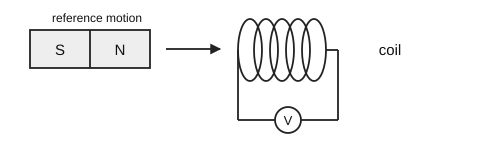

**A** negative, zero, positive  
**B** positive, zero, negative  
**C** negative, negative, positive  
**D** positive, zero, positive  
**E** negative, zero, negative  

Answer and solution

**Answer: A.**

Changing the approaching pole reverses the voltage, so the first stage is negative. A stationary magnet gives no changing field and hence zero voltage. Reversing its motion reverses the voltage again, giving positive.

Topic: Electromagnetic induction. Specification: P2.4(a-c). Estimated time: 75 s.

## Question 2

The graph shows the current through a filament lamp at different voltages. The lamp is connected in series with a \(10\,\Omega\) resistor to a \(7.0\,\mathrm{V}\) d.c. supply.

What is the power transferred to the lamp?

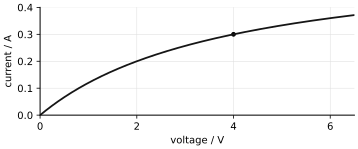

**A** \(0.90\,\mathrm{W}\)  
**B** \(1.2\,\mathrm{W}\)  
**C** \(1.6\,\mathrm{W}\)  
**D** \(2.1\,\mathrm{W}\)  
**E** \(2.8\,\mathrm{W}\)  

Answer and solution

**Answer: B.**

At \(I=0.30\,\mathrm{A}\), the graph gives \(V_{\rm lamp}=4.0\,\mathrm{V}\). The resistor voltage is \(IR=3.0\,\mathrm{V}\), so this operating point uses the full \(7.0\,\mathrm{V}\). Thus \(P_{\rm lamp}=VI=4.0\times0.30=1.2\,\mathrm{W}\). The total supply power is not the lamp power.

Topic: Circuit components. Specification: P1.2(f-g,i,m). Estimated time: 95 s.

## Question 3

A spring obeys Hooke's law. A force of \(6.0\,\mathrm{N}\) produces an extension of \(3.0\,\mathrm{cm}\).

The spring is already extended by \(2.0\,\mathrm{cm}\). How much additional energy must be transferred to the spring to increase its extension to \(5.0\,\mathrm{cm}\)?

**A** \(0.09\,\mathrm{J}\)  
**B** \(0.15\,\mathrm{J}\)  
**C** \(0.21\,\mathrm{J}\)  
**D** \(0.25\,\mathrm{J}\)  
**E** \(0.29\,\mathrm{J}\)  

Answer and solution

**Answer: C.**

The spring constant is \(k=6.0/0.030=200\,\mathrm{N\,m^{-1}}\). Subtract the initial stored energy from the final stored energy:
\[\Delta E=\tfrac12(200)(0.050^2-0.020^2)=0.21\,\mathrm{J}.\]
Using only the change in extension in \(\tfrac12kx^2\) would be incorrect.

Topic: Springs and elasticity. Specification: P3.3(c-d). Estimated time: 90 s.

## Question 4

A detector records the mean count rates shown for a source emitting two types of radiation. Its background count rate is \(20\,\mathrm{counts\,min^{-1}}\).

The paper stops all alpha particles. The aluminium stops all alpha and beta particles. Neither absorber significantly affects gamma radiation.

Which two types are detected from the source, and what is the count rate due to the more penetrating type alone?

| Absorber | Mean count rate / counts min⁻¹ |
| --- | --- |
| none | 240 |
| paper | 240 |
| aluminium | 90 |

**A** alpha and beta; \(70\,\mathrm{counts\,min^{-1}}\)  
**B** alpha and gamma; \(90\,\mathrm{counts\,min^{-1}}\)  
**C** beta and gamma; \(70\,\mathrm{counts\,min^{-1}}\)  
**D** beta and gamma; \(90\,\mathrm{counts\,min^{-1}}\)  
**E** beta and gamma; \(150\,\mathrm{counts\,min^{-1}}\)  

Answer and solution

**Answer: C.**

Paper causes no reduction, so no detected alpha component is present. Aluminium removes a beta component but leaves gamma plus background. The gamma contribution is \(90-20=70\,\mathrm{counts\,min^{-1}}\).

Topic: Radioactivity. Specification: P7.3(a,d). Estimated time: 80 s.

## Question 5

An ideal transformer has \(800\) turns on its primary coil and \(40\) on its secondary coil. The primary is supplied at \(240\,\mathrm{V}\) a.c.

Identical lamps rated at \(12\,\mathrm{V},\ 6.0\,\mathrm{W}\) are connected in parallel across the secondary. The primary current must not exceed \(0.15\,\mathrm{A}\).

What is the largest number of lamps that can operate at their rated power?

**A** 3  
**B** 4  
**C** 5  
**D** 6  
**E** 12  

Answer and solution

**Answer: D.**

The secondary voltage is \(240\times40/800=12\,\mathrm{V}\), as required. The maximum input power is \(240\times0.15=36\,\mathrm{W}\). For an ideal transformer the output power is also \(36\,\mathrm{W}\), enough for \(36/6=6\) lamps.

Topic: Transformers and transmission. Specification: P2.5(b-c); P1.2(m). Estimated time: 90 s.

## Question 6

Paint droplets are given a negative charge before being sprayed towards a positively charged metal panel. The droplets stick to the panel and transfer their excess electrons to it.

The panel is kept at a constant positive charge by an electrical connection. Which row describes the electric force between two droplets and the electron transfer needed through the connection?

**A** droplets attract; electrons enter the panel  
**B** droplets attract; electrons leave the panel  
**C** droplets repel; electrons enter the panel  
**D** no force between droplets; no electron transfer  
**E** droplets repel; electrons leave the panel  

Answer and solution

**Answer: E.**

The negatively charged droplets repel one another. They deliver excess electrons to the panel, reducing its positive charge. Electrons must therefore leave through the connection to maintain the panel's positive charge.

Topic: Electrostatics. Specification: P1.1(b-d). Estimated time: 65 s.

## Question 7

A light ray crosses a boundary from material X into material Y. The angles marked on the diagram are measured between the ray and the boundary.

Which statement correctly compares the wave in Y with the wave in X?

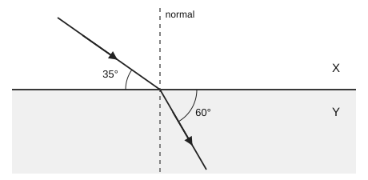

**A** lower speed, lower frequency  
**B** lower speed, same frequency  
**C** higher speed, same frequency  
**D** higher speed, higher frequency  
**E** same speed, same frequency  

Answer and solution

**Answer: B.**

The angles to the normal are \(90^\circ-35^\circ=55^\circ\) in X and \(90^\circ-60^\circ=30^\circ\) in Y. The ray bends towards the normal, so its speed decreases. Its frequency is unchanged at the boundary.

Topic: Refraction. Specification: P6.2(b-c); P6.3(c-e). Estimated time: 75 s.

## Question 8

A pure substance is heated at constant power. The graph shows its temperature. During the horizontal section, solid and liquid are both present. Energy losses are negligible.

Which statement is correct during this horizontal section?

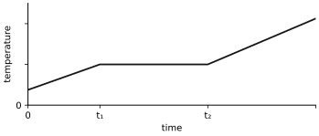

**A** The average kinetic energy of its particles stays constant while their potential energy increases.  
**B** The average kinetic energy of its particles increases while their potential energy stays constant.  
**C** No energy is transferred to the substance.  
**D** Both the average kinetic energy and potential energy of its particles decrease.  
**E** The particles stop moving until melting is complete.  

Answer and solution

**Answer: A.**

The constant temperature means that average particle kinetic energy is unchanged. Energy is still supplied and is used to change the arrangement and separation of particles during melting, increasing their potential energy.

Topic: Particle models and states. Specification: P5.1; P5.3. Estimated time: 80 s.

## Question 9

Two long straight wires P and Q carry equal currents out of the page. Point M is midway between them. The magnetic field at M due to either wire alone has magnitude \(B\). Other magnetic fields are negligible.

The current in Q is reversed without changing its magnitude. What is the resultant magnetic field at M?

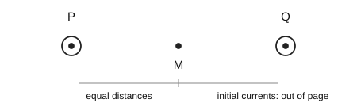

**A** zero  
**B** \(B\), upwards on the page  
**C** \(B\), downwards on the page  
**D** \(2B\), downwards on the page  
**E** \(2B\), upwards on the page  

Answer and solution

**Answer: E.**

The field around P is anticlockwise, so at M, to its right, the field points upwards. Reversing Q makes its field clockwise; at M, to its left, that field also points upwards. The two equal fields add to \(2B\).

Topic: Basic magnetism. Specification: P2.2(a-c). Estimated time: 80 s.

## Question 10

An ultrasound pulse enters a layer of tissue along a line perpendicular to its two parallel surfaces. Echoes from the front and back surfaces return to the transmitter \(30\,\mu\mathrm{s}\) and \(70\,\mu\mathrm{s}\) after emission.

The speed of ultrasound in the layer is \(1500\,\mathrm{m\,s^{-1}}\). What is the thickness of the layer?

**A** \(1.5\,\mathrm{cm}\)  
**B** \(3.0\,\mathrm{cm}\)  
**C** \(4.5\,\mathrm{cm}\)  
**D** \(6.0\,\mathrm{cm}\)  
**E** \(7.5\,\mathrm{cm}\)  

Answer and solution

**Answer: B.**

The extra return time is \(70-30=40\,\mu\mathrm{s}\). It corresponds to travelling through the layer twice. Hence
\[d=\frac{1500\times40\times10^{-6}}{2}=0.030\,\mathrm{m}=3.0\,\mathrm{cm}.\]

Topic: Sound and ultrasound. Specification: P6.1(g); P6.4(g). Estimated time: 85 s.

## Question 11

The graph shows the voltage from a simple a.c. generator whose coil rotates at constant speed. One voltage cycle corresponds to one complete rotation.

The rotation speed is doubled and the magnetic field strength is left unchanged. The coil starts in the same position and rotates in the same direction.

What is the first time after \(t=0\) at which the new voltage reaches a positive maximum, and how does the new peak voltage compare with the old peak voltage?

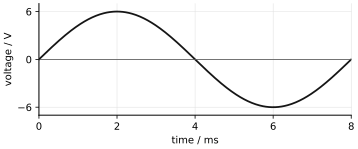

**A** \(1.0\,\mathrm{ms}\); smaller  
**B** \(1.0\,\mathrm{ms}\); larger  
**C** \(2.0\,\mathrm{ms}\); unchanged  
**D** \(4.0\,\mathrm{ms}\); larger  
**E** \(8.0\,\mathrm{ms}\); unchanged  

Answer and solution

**Answer: B.**

The original period is \(8.0\,\mathrm{ms}\), so the first positive maximum is at \(2.0\,\mathrm{ms}\). Doubling the rotation speed halves all corresponding times, giving \(1.0\,\mathrm{ms}\). Faster cutting of the magnetic field produces a larger peak voltage.

Topic: Electromagnetic induction. Specification: P2.4(d-e); P6.1(f). Estimated time: 90 s.

## Question 12

An LDR and a \(3.0\,\mathrm{k\Omega}\) resistor are connected in series across a \(12\,\mathrm{V}\) supply, as shown. A control unit switches on when the voltage across the fixed resistor exceeds \(8.0\,\mathrm{V}\). The control unit draws negligible current.

At what LDR resistance is the voltage exactly \(8.0\,\mathrm{V}\), and which change will then switch the control unit on?

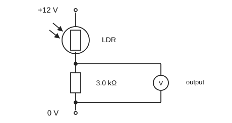

**A** \(1.5\,\mathrm{k\Omega}\); increasing light intensity  
**B** \(1.5\,\mathrm{k\Omega}\); decreasing light intensity  
**C** \(2.0\,\mathrm{k\Omega}\); increasing light intensity  
**D** \(6.0\,\mathrm{k\Omega}\); increasing light intensity  
**E** \(6.0\,\mathrm{k\Omega}\); decreasing light intensity  

Answer and solution

**Answer: A.**

The fixed resistor has \(8.0\,\mathrm{V}\), leaving \(4.0\,\mathrm{V}\) across the LDR. Their current is the same, so \(R_{\rm LDR}/3.0=4.0/8.0\), giving \(1.5\,\mathrm{k\Omega}\). More light reduces the LDR resistance, increasing current and the fixed-resistor voltage.

Topic: Circuit components. Specification: P1.2(h-i,f). Estimated time: 100 s.

## Question 13

A transmission line receives \(20\,\mathrm{kW}\) at \(2.0\,\mathrm{kV}\). The total resistance of its cables is \(5.0\,\Omega\).

The voltage at the sending end is increased to \(10\,\mathrm{kV}\), while the power entering the line remains \(20\,\mathrm{kW}\). The cable resistance is unchanged.

By how much does the power lost in the cables decrease?

**A** \(20\,\mathrm{W}\)  
**B** \(100\,\mathrm{W}\)  
**C** \(400\,\mathrm{W}\)  
**D** \(480\,\mathrm{W}\)  
**E** \(500\,\mathrm{W}\)  

Answer and solution

**Answer: D.**

Initially \(I=20000/2000=10\,\mathrm{A}\), so the loss is \(I^2R=500\,\mathrm{W}\). Afterwards \(I=20000/10000=2\,\mathrm{A}\), so the loss is \(20\,\mathrm{W}\). The reduction is \(500-20=480\,\mathrm{W}\).

Topic: Transformers and transmission. Specification: P2.5(d); P1.2(m). Estimated time: 90 s.

## Question 14

Narrow beams of alpha particles, beta-minus particles and gamma radiation enter the region between two charged plates. The beams initially travel horizontally to the right. The upper plate is positive and the lower plate is negative.

Which row gives the direction in which each beam bends?

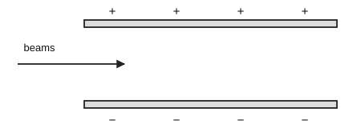

**A** alpha downwards; beta upwards; gamma straight  
**B** alpha upwards; beta downwards; gamma straight  
**C** alpha downwards; beta straight; gamma upwards  
**D** alpha upwards; beta upwards; gamma straight  
**E** alpha straight; beta upwards; gamma downwards  

Answer and solution

**Answer: A.**

Alpha particles are positive and are attracted towards the lower negative plate. Beta-minus particles are negative and are attracted towards the upper positive plate. Uncharged gamma radiation is not deflected.

Topic: Radioactivity. Specification: P7.2(d); P7.3(c). Estimated time: 75 s.

## Question 15

Two identical light springs obey Hooke's law. In arrangement X they are in series; in arrangement Y they are in parallel. The same load of weight \(W\) is supported at rest in each arrangement.

What is the ratio of the total elastic energy stored in X to that stored in Y?

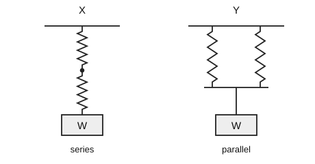

**A** \(1:4\)  
**B** \(1:2\)  
**C** \(1:1\)  
**D** \(2:1\)  
**E** \(4:1\)  

Answer and solution

**Answer: E.**

Let each spring constant be \(k\). In X, each spring carries \(W\), so the total energy is \(2[W^2/(2k)]=W^2/k\). In Y, each carries \(W/2\), so the total energy is \(2[(W/2)^2/(2k)]=W^2/(4k)\). The ratio is \(4:1\).

Topic: Springs and elasticity. Specification: P3.3(c-d); P3.2(c-d). Estimated time: 100 s.

## Question 16

Three devices use different regions of the electromagnetic spectrum:

1. a thermal camera detecting radiation emitted by a warm hand;
2. a lamp producing ultraviolet radiation;
3. a scanner producing X-rays.

Which row lists the devices in order of increasing radiation frequency and correctly compares the speeds of their radiation in a vacuum?

**A** 1, 2, 3; all three speeds are equal  
**B** 1, 3, 2; all three speeds are equal  
**C** 3, 2, 1; all three speeds are equal  
**D** 1, 2, 3; speed increases in this order  
**E** 2, 1, 3; speed decreases in this order  

Answer and solution

**Answer: A.**

The thermal camera detects infrared. The frequency order is infrared, ultraviolet, X-rays. All three are electromagnetic waves and travel at the same speed in a vacuum, despite their different frequencies.

Topic: Electromagnetic spectrum. Specification: P6.5(b-e). Estimated time: 65 s.

## Question 17

An initially uncharged insulating object loses \(5.0\times10^{10}\) electrons when rubbed. It later gains \(2.0\times10^{10}\) electrons.

What is its final charge? The magnitude of the charge on one electron is \(1.6\times10^{-19}\,\mathrm{C}\).

**A** \(-11.2\,\mathrm{nC}\)  
**B** \(-4.8\,\mathrm{nC}\)  
**C** \(+3.2\,\mathrm{nC}\)  
**D** \(+4.8\,\mathrm{nC}\)  
**E** \(+11.2\,\mathrm{nC}\)  

Answer and solution

**Answer: D.**

Overall the object has lost \(3.0\times10^{10}\) electrons, so it is positive. The charge is \((3.0\times10^{10})(1.6\times10^{-19})=4.8\times10^{-9}\,\mathrm{C}=+4.8\,\mathrm{nC}\).

Topic: Electrostatics. Specification: P1.1(b); P1.2(d). Estimated time: 80 s.

## Question 18

Straight water waves cross a boundary from deep water into shallow water. In the deep water, the distance from the first crest to the fifth crest is \(24\,\mathrm{cm}\). The wave speed there is \(30\,\mathrm{cm\,s^{-1}}\).

In the shallow water, the distance from the first crest to the fifth crest is \(16\,\mathrm{cm}\).

What are the wave frequency and the speed in the shallow water?

**A** \(1.25\,\mathrm{Hz}\), \(20\,\mathrm{cm\,s^{-1}}\)  
**B** \(5.0\,\mathrm{Hz}\), \(20\,\mathrm{cm\,s^{-1}}\)  
**C** \(5.0\,\mathrm{Hz}\), \(45\,\mathrm{cm\,s^{-1}}\)  
**D** \(7.5\,\mathrm{Hz}\), \(30\,\mathrm{cm\,s^{-1}}\)  
**E** \(1.25\,\mathrm{Hz}\), \(5.0\,\mathrm{cm\,s^{-1}}\)  

Answer and solution

**Answer: B.**

Five crests span four wavelengths: \(\lambda_d=24/4=6\,\mathrm{cm}\). Thus \(f=30/6=5\,\mathrm{Hz}\). Frequency is unchanged by refraction, and \(\lambda_s=16/4=4\,\mathrm{cm}\), so \(v_s=5\times4=20\,\mathrm{cm\,s^{-1}}\).

Topic: Refraction. Specification: P6.1(h); P6.2(b-d). Estimated time: 85 s.

## Question 19

Two stationary coils share an iron core. The graph shows the current in coil P. A voltmeter is connected across coil Q.

Increasing the current in P produces a positive voltage in Q. The voltmeter connections are fixed.

During which labelled intervals is the voltage in Q non-zero?

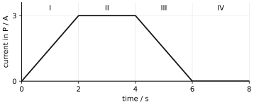

**A** I and II only  
**B** all four intervals  
**C** I, III and IV only  
**D** II and IV only  
**E** I and III only  

Answer and solution

**Answer: E.**

Only a changing current in P produces a changing magnetic field and an induced voltage in Q. The current increases in I and decreases in III, so the induced voltages are non-zero with opposite signs. The constant currents in II and IV give zero voltage, even though the current in II is non-zero.

Topic: Electromagnetic induction. Specification: P2.4(a-c). Estimated time: 85 s.

## Question 20

An NTC thermistor is connected in series with a \(2.0\,\mathrm{k\Omega}\) resistor across a constant \(12\,\mathrm{V}\) supply. At the initial temperature the thermistor resistance is \(4.0\,\mathrm{k\Omega}\).

The thermistor is warmed until its resistance becomes \(1.0\,\mathrm{k\Omega}\). What happens to the electrical power transferred to the thermistor?

**A** It decreases to one quarter of its initial value.  
**B** It decreases to one half of its initial value.  
**C** It remains unchanged.  
**D** It doubles.  
**E** It quadruples.  

Answer and solution

**Answer: C.**

Initially \(I=12/6000=2.0\,\mathrm{mA}\), giving \(P_T=I^2R_T=16\,\mathrm{mW}\). Afterwards \(I=12/3000=4.0\,\mathrm{mA}\), giving \(P_T=(0.004)^2(1000)=16\,\mathrm{mW}\). The current doubles while the thermistor resistance falls by four.

Topic: Circuit components. Specification: P1.2(f,h-i,m). Estimated time: 90 s.

## Question 21

The north pole of a permanent magnet is brought close to end X of an initially unmagnetised soft-iron bar. The far end of the bar is Y.

A small compass is placed just beyond Y, on the axis of the bar. Which way does the north-seeking end of the compass point, and why is soft iron suitable for an electromagnet that must release its load when switched off?

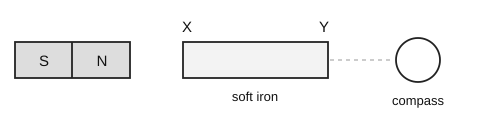

**A** towards Y; it is difficult to magnetise  
**B** towards Y; it retains a strong magnetisation  
**C** away from Y; it retains a strong magnetisation  
**D** towards Y; it loses most of its magnetisation when the applied field is removed  
**E** away from Y; it loses most of its magnetisation when the applied field is removed  

Answer and solution

**Answer: E.**

The nearby north pole induces a south pole at X and a north pole at Y. Outside a north pole the field points away, so the compass north end points away from Y. Soft iron is useful because its induced magnetisation largely disappears when the applied field is removed.

Topic: Basic magnetism. Specification: P2.1(a,c-d). Estimated time: 80 s.

## Question 22

A shallow dish of water is left in a room at constant temperature. For a short time, evaporation cools the remaining water below room temperature.

Which pair of statements explains this cooling?

**A** Faster particles escape preferentially; the average kinetic energy of the remaining particles decreases.  
**B** Slower particles escape preferentially; the average kinetic energy of the remaining particles decreases.  
**C** Faster particles escape preferentially; the remaining particles become smaller.  
**D** All particles slow down by the same amount before any can escape.  
**E** Evaporation can occur only after every particle has the same kinetic energy.  

Answer and solution

**Answer: A.**

Particles have a range of kinetic energies. Those with enough energy can escape from the surface. Preferential loss of these higher-energy particles reduces the average kinetic energy, and hence the temperature, of the remaining water.

Topic: Particle models and states. Specification: P5.1; P5.3(a). Estimated time: 70 s.

## Question 23

An ideal transformer has one primary coil and two separate secondary coils. The primary has \(600\) turns and is supplied at \(120\,\mathrm{V}\) a.c.

Secondary X has \(60\) turns and supplies a \(6.0\,\Omega\) resistor. Secondary Y has \(120\) turns and supplies a \(24\,\Omega\) resistor. Both loads are connected simultaneously.

What is the primary current?

**A** \(0.20\,\mathrm{A}\)  
**B** \(0.30\,\mathrm{A}\)  
**C** \(0.40\,\mathrm{A}\)  
**D** \(0.60\,\mathrm{A}\)  
**E** \(3.0\,\mathrm{A}\)  

Answer and solution

**Answer: C.**

The secondary voltages are \(12\,\mathrm{V}\) and \(24\,\mathrm{V}\). The load powers are \(12^2/6=24\,\mathrm{W}\) and \(24^2/24=24\,\mathrm{W}\). The input supplies both: \(I_p=(24+24)/120=0.40\,\mathrm{A}\).

Topic: Transformers and transmission. Specification: P2.5(b-c); P1.2(m). Estimated time: 105 s.

## Question 24

An oscilloscope displays the signal from a microphone. For each sound, the trace measurements and oscilloscope settings are given in the table. The microphone's voltage amplitude is proportional to the sound-wave amplitude.

Compared with sound P, sound Q has:

| Sound | Divisions per cycle | Time / ms per division | Peak height / divisions | Voltage / V per division |
| --- | --- | --- | --- | --- |
| P | 4.0 | 0.50 | 3.0 | 0.20 |
| Q | 2.0 | 0.50 | 2.0 | 0.30 |

**A** half the frequency and the same amplitude  
**B** the same frequency and half the amplitude  
**C** the same frequency and the same amplitude  
**D** double the frequency and double the amplitude  
**E** double the frequency and the same amplitude  

Answer and solution

**Answer: E.**

For P, \(T_P=4\times0.50=2.0\,\mathrm{ms}\). For Q, \(T_Q=2\times0.50=1.0\,\mathrm{ms}\), so its frequency is doubled. Both voltage amplitudes are \(3\times0.20=2\times0.30=0.60\,\mathrm{V}\); hence the sound amplitudes are equal.

Topic: Sound and ultrasound. Specification: P6.1(e-f); P6.4(c). Estimated time: 85 s.

## Question 25

A spring has an original length of \(10.0\,\mathrm{cm}\). It is stretched beyond its elastic limit. The graph shows the force as the spring is then unloaded.

What is the spring's length when the force has fallen to \(2.0\,\mathrm{N}\), and what is its permanent increase in length after complete unloading?

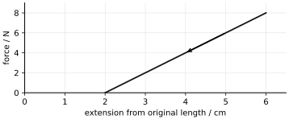

**A** \(11.0\,\mathrm{cm}\); \(2.0\,\mathrm{cm}\)  
**B** \(13.0\,\mathrm{cm}\); zero  
**C** \(13.0\,\mathrm{cm}\); \(2.0\,\mathrm{cm}\)  
**D** \(14.0\,\mathrm{cm}\); \(2.0\,\mathrm{cm}\)  
**E** \(16.0\,\mathrm{cm}\); \(6.0\,\mathrm{cm}\)  

Answer and solution

**Answer: C.**

At \(2.0\,\mathrm{N}\), the graph gives an extension of \(3.0\,\mathrm{cm}\) relative to the original length, so the length is \(13.0\,\mathrm{cm}\). When the force reaches zero, \(2.0\,\mathrm{cm}\) of extension remains permanently.

Topic: Springs and elasticity. Specification: P3.3(a-b). Estimated time: 95 s.

## Question 26

A straight horizontal metal rod lies in the plane of the page in a uniform magnetic field directed into the page. The rod is moved without rotating.

Consider these motions:

1. vertically upwards in the plane of the page;
2. horizontally to the right, along the rod's own length;
3. directly into the page, parallel to the magnetic field.

For which motions is a voltage induced between the two ends of the rod?

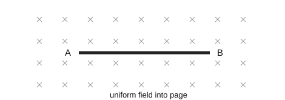

**A** 1 only  
**B** 2 only  
**C** 3 only  
**D** 1 and 2 only  
**E** all three  

Answer and solution

**Answer: A.**

In motion 1 the rod cuts field lines so that opposite charges are separated towards its two ends. Moving along its own length does not produce end-to-end charge separation. Moving parallel to the field does not cut the field lines. Only motion 1 gives an end-to-end induced voltage.

Topic: Electromagnetic induction. Specification: P2.4(a-c). Estimated time: 80 s.

## Question 27

A \(12\,\mathrm{V}\) d.c. supply is connected to the circuit shown. The ideal diode initially conducts. A conducting ideal diode has zero resistance; in the reverse direction it blocks all current.

The supply connections are reversed. What is the new total power supplied to the circuit?

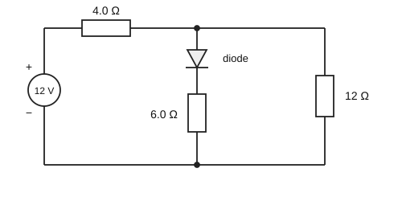

**A** \(6.0\,\mathrm{W}\)  
**B** \(9.0\,\mathrm{W}\)  
**C** \(12\,\mathrm{W}\)  
**D** \(18\,\mathrm{W}\)  
**E** \(36\,\mathrm{W}\)  

Answer and solution

**Answer: B.**

Reversal blocks the diode branch completely. The remaining conducting path contains \(4.0\,\Omega\) and \(12\,\Omega\) in series, so \(R=16\,\Omega\). Hence \(I=12/16=0.75\,\mathrm{A}\) and \(P=VI=9.0\,\mathrm{W}\). The blocked branch is an open circuit, not a short circuit.

Topic: Circuit components. Specification: P1.2(h-k,m). Estimated time: 105 s.

## Question 28

A short pulse of light travels normally through a transparent block of thickness \(12\,\mathrm{cm}\). Its speed in the block is \(2.0\times10^8\,\mathrm{m\,s^{-1}}\).

The block is replaced by a second block of the same thickness in which the pulse travels at \(1.5\times10^8\,\mathrm{m\,s^{-1}}\). The rest of the pulse's path is unchanged.

By how much does its arrival at a detector become later?

**A** \(0.10\,\mathrm{ns}\)  
**B** \(0.20\,\mathrm{ns}\)  
**C** \(0.40\,\mathrm{ns}\)  
**D** \(0.60\,\mathrm{ns}\)  
**E** \(0.80\,\mathrm{ns}\)  

Answer and solution

**Answer: B.**

The original transit time is \(0.12/(2.0\times10^8)=0.60\,\mathrm{ns}\). The replacement gives \(0.12/(1.5\times10^8)=0.80\,\mathrm{ns}\). Subtracting gives an extra delay of \(0.20\,\mathrm{ns}\). No bending occurs at normal incidence, but speed still changes.

Topic: Refraction. Specification: P6.1(g); P6.2(b-c). Estimated time: 100 s.

## Question 29

A source and detector monitor the thickness of a continuous sheet of paper. The source must work for several years without a large correction for radioactive decay. Alpha radiation is completely stopped by the paper; beta radiation is partly absorbed; gamma radiation is hardly affected by changes in the paper's thickness.

Which source is most suitable, and what happens to the detector count rate if the sheet becomes thinner?

**A** alpha, half-life 20 years; decreases  
**B** beta, half-life 2 hours; increases  
**C** beta, half-life 20 years; increases  
**D** beta, half-life 20 years; decreases  
**E** gamma, half-life 20 years; increases strongly  

Answer and solution

**Answer: C.**

Beta radiation is sensitive to the relevant thickness changes. A long half-life avoids rapid changes in source output. A thinner sheet absorbs fewer beta particles, so the detected count rate increases.

Topic: Radioactivity. Specification: P7.3(a,e); P7.4(b). Estimated time: 90 s.

## Question 30

The left-hand end of a solenoid is viewed directly. The current around this end flows anticlockwise, as shown. A small compass is placed on the solenoid's axis just beyond its right-hand end. Other magnetic fields are negligible.

Which way does the compass's north-seeking end point initially, and after the current is reversed?

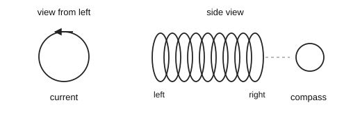

**A** right initially; right afterwards  
**B** right initially; left afterwards  
**C** left initially; left afterwards  
**D** left initially; right afterwards  
**E** upwards initially; downwards afterwards  

Answer and solution

**Answer: D.**

Anticlockwise current makes the viewed left end a north pole, so the right end is a south pole. Just to the right of a south pole, the field points left towards it. Reversing the current reverses the poles and the field, so the compass then points right.

Topic: Basic magnetism. Specification: P2.1(b); P2.2(b). Estimated time: 85 s.

## Question 31

A fixed mass of gas is sealed in a rigid container and heated. Which statement best explains the increase in pressure?

**A** The particles have greater average speed and transfer more momentum to the walls per unit time.  
**B** The particles become larger, so less empty space remains.  
**C** The number of particles increases while their average speed remains constant.  
**D** The particles move more slowly and therefore remain in contact with the walls for longer.  
**E** The average spacing between particles must increase because the gas is hotter.  

Answer and solution

**Answer: A.**

Heating increases average particle kinetic energy and speed. More frequent and more forceful wall collisions increase momentum transferred per unit time, hence force and pressure. The fixed particle number and container volume rule out an increase in particle number or average spacing.

Topic: Particle models and states. Specification: P5.1(b); P5.2(a-b). Estimated time: 75 s.

## Question 32

The graph shows the voltage produced by an electromagnetic generator during one complete cycle. It is connected in series with a \(2.0\,\mathrm{k\Omega}\) resistor and an ideal diode. The diode allows current only when the plotted voltage is positive. The voltage is unchanged by the connection.

How much charge passes through the resistor during one complete cycle?

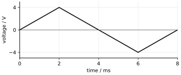

**A** \(2.0\,\mu\mathrm{C}\)  
**B** \(4.0\,\mu\mathrm{C}\)  
**C** \(8.0\,\mu\mathrm{C}\)  
**D** \(16\,\mu\mathrm{C}\)  
**E** zero  

Answer and solution

**Answer: B.**

The peak current in the positive half-cycle is \(4.0/2000=2.0\,\mathrm{mA}\). Its current-time graph is a triangle of base \(4.0\,\mathrm{ms}\). The charge is its area:
\[Q=\tfrac12(4.0\times10^{-3})(2.0\times10^{-3})=4.0\,\mu\mathrm{C}.\]
The diode blocks the negative half-cycle, so it does not cancel this charge.

Topic: Electromagnetic induction. Specification: P2.4(e-f); P1.2(d,f,h); M4.14. Estimated time: 100 s.

## Question 33

An ideal transformer supplies a fixed resistor. The primary voltage is held constant.

The transformer is replaced with another ideal transformer having half as many primary turns and the same number of secondary turns. The same resistor is connected across the secondary.

By what factor does the primary current change?

**A** \(\tfrac14\)  
**B** \(\tfrac12\)  
**C** 1  
**D** 2  
**E** 4  

Answer and solution

**Answer: E.**

Halving the primary turns doubles the secondary voltage. With the same load resistance, secondary current also doubles, so output power quadruples. Input power therefore quadruples; since primary voltage is fixed, primary current increases by a factor of four.

Topic: Transformers and transmission. Specification: P2.5(b-c); P1.2(m). Estimated time: 100 s.

## Question 34

An insulated metal tank acquires a positive charge as fuel flows out. It is then connected to Earth by a conducting wire and becomes uncharged.

Which row correctly describes the charging process and the particle movement through the wire during discharge?

**A** The tank gained protons; protons move from the tank to Earth.  
**B** The tank lost electrons; electrons move from the tank to Earth.  
**C** The tank gained electrons; electrons move from Earth to the tank.  
**D** The tank lost protons; protons move from Earth to the tank.  
**E** The tank lost electrons; electrons move from Earth to the tank.  

Answer and solution

**Answer: E.**

Positive charging means a loss of electrons, not a gain of protons. Earthing allows electrons to enter from Earth and replace that deficit. The conducting path prevents a large charge build-up that could cause a spark.

Topic: Electrostatics. Specification: P1.1(b-d). Estimated time: 80 s.

## Question 35

A station sends a microwave signal to a satellite \(36000\,\mathrm{km}\) away. The satellite immediately sends an infrared signal to a second station \(45000\,\mathrm{km}\) away from it.

Treat both paths as vacuum and ignore processing time. The speed of light is \(3.0\times10^8\,\mathrm{m\,s^{-1}}\).

What is the shortest time between emission at the first station and reception at the second?

**A** \(0.030\,\mathrm{s}\)  
**B** \(0.12\,\mathrm{s}\)  
**C** \(0.15\,\mathrm{s}\)  
**D** \(0.27\,\mathrm{s}\)  
**E** \(0.54\,\mathrm{s}\)  

Answer and solution

**Answer: D.**

Both microwave and infrared signals travel at the same speed in vacuum. Add the two path lengths, rather than their difference:
\[t=\frac{(36000+45000)\times1000}{3.0\times10^8}=0.27\,\mathrm{s}.\]

Topic: Electromagnetic spectrum. Specification: P6.1(g); P6.5(a,e). Estimated time: 80 s.

## Question 36

A \(0.050\,\mathrm{kg}\) block is launched along a horizontal track by a spring of spring constant \(800\,\mathrm{N\,m^{-1}}\), initially compressed by \(5.0\,\mathrm{cm}\). The spring obeys Hooke's law and is not attached to the block.

The block loses \(0.20\,\mathrm{J}\) of energy on a rough section, then rises up a smooth slope. All other energy losses are negligible.

What maximum vertical height does it reach above its starting level? Take \(g=10\,\mathrm{N\,kg^{-1}}\).

**A** \(0.40\,\mathrm{m}\)  
**B** \(0.80\,\mathrm{m}\)  
**C** \(1.0\,\mathrm{m}\)  
**D** \(1.6\,\mathrm{m}\)  
**E** \(2.0\,\mathrm{m}\)  

Answer and solution

**Answer: D.**

The initial spring energy is \(\tfrac12(800)(0.050)^2=1.0\,\mathrm{J}\). After the rough section, \(0.80\,\mathrm{J}\) remains. At the highest point this is gravitational potential energy:
\[h=\frac{0.80}{0.050\times10}=1.6\,\mathrm{m}.\]

Topic: Springs and elasticity. Specification: P3.3(d); P3.7(c,f). Estimated time: 95 s.

## Question 37

A sample initially contains \(120\) unstable nuclei of one isotope. Each nucleus decays directly to a stable nucleus. After one half-life, \(72\) unstable nuclei remain.

Which statement is correct?

**A** The observation proves that the quoted half-life is wrong.  
**B** Exactly 36 of the remaining nuclei must decay during the next half-life.  
**C** The 72 surviving nuclei are less likely to decay because they have already survived one half-life.  
**D** The expected number remaining after the next half-life is 36, but the actual number may differ.  
**E** The next decay must occur after exactly one seventy-second of a half-life.  

Answer and solution

**Answer: D.**

Half-life describes the probability of decay, not an exact schedule for a small sample. Each surviving nucleus still has a one-half probability of surviving the next half-life. The expected number remaining is \(72/2=36\), with random variation around that value.

Topic: Radioactivity. Specification: P7.2(b); P7.4(b). Estimated time: 80 s.

## Question 38

Each diagram is intended to show a ray travelling from air through a rectangular glass block and back into air. Light travels more slowly in glass than in air. The two faces crossed are parallel.

Which diagram shows a possible path? Ignore partial reflection.

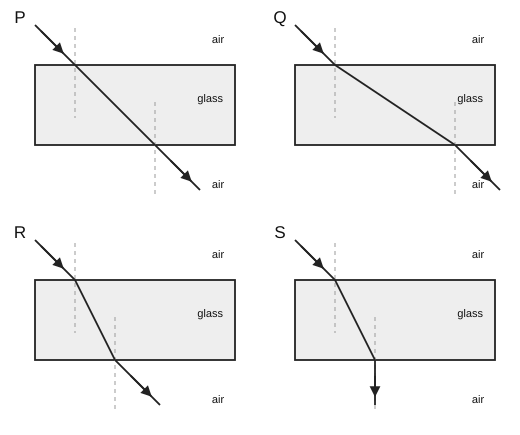

**A** P  
**B** Q  
**C** R  
**D** S  
**E** None of them  

Answer and solution

**Answer: C.**

The ray must bend towards the normal on entering glass and away from the normal on leaving. For parallel faces with air on both sides, the emergent ray is parallel to the incident ray. Only R satisfies all these conditions.

Topic: Refraction. Specification: P6.2(b-c); P6.3(c-e). Estimated time: 90 s.

## Question 39

A sound wave travels to the right through a long tube of air. A tiny marked air particle is initially at P.

Which description of the particle's motion is correct as the wave passes?

**A** It travels to the right with the wave and stops far from P.  
**B** It oscillates up and down, perpendicular to the tube.  
**C** It moves back and forth along the tube, with no net transport over a complete oscillation.  
**D** It remains stationary while the surrounding air carries the wave.  
**E** It follows a circular path whose radius is the wavelength.  

Answer and solution

**Answer: C.**

Sound in air is longitudinal: particles move back and forth parallel to the propagation direction. Energy moves along the tube without the bulk transport of air with the wave.

Topic: Sound and ultrasound. Specification: P6.1(a-c); P6.4(b,d). Estimated time: 65 s.

## Question 40

An LDR and a fixed \(1.0\,\mathrm{k\Omega}\) resistor are connected in series across an ideal \(9.0\,\mathrm{V}\) supply. At the fixed light intensity, the working LDR has resistance \(2.0\,\mathrm{k\Omega}\).

A fault develops in exactly one component. An ideal voltmeter across the LDR now reads \(9.0\,\mathrm{V}\), and an ideal ammeter in series with the supply reads \(4.5\,\mathrm{mA}\). All connecting wires remain intact.

Which fault is consistent with both readings?

**A** The LDR has become an open circuit.  
**B** The LDR has become a short circuit.  
**C** The fixed resistor has become an open circuit.  
**D** The fixed resistor has become a short circuit.  
**E** The LDR resistance has increased to \(3.0\,\mathrm{k\Omega}\).  

Answer and solution

**Answer: D.**

The observed total resistance is \(9.0/0.0045=2000\,\Omega\), exactly the working LDR resistance. The LDR has the whole supply voltage, so the fixed resistor must have zero voltage across it while carrying current: it is short-circuited. An open LDR could give the voltage reading but would give zero current.

Topic: Circuit components. Specification: P1.2(e-f,h-i). Estimated time: 95 s.

